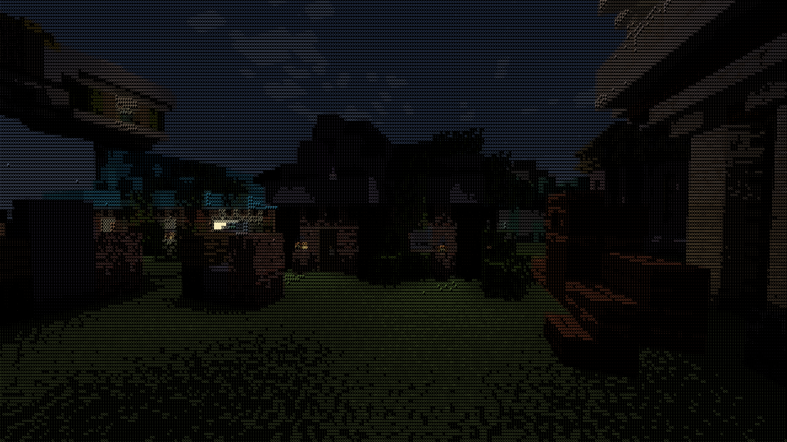
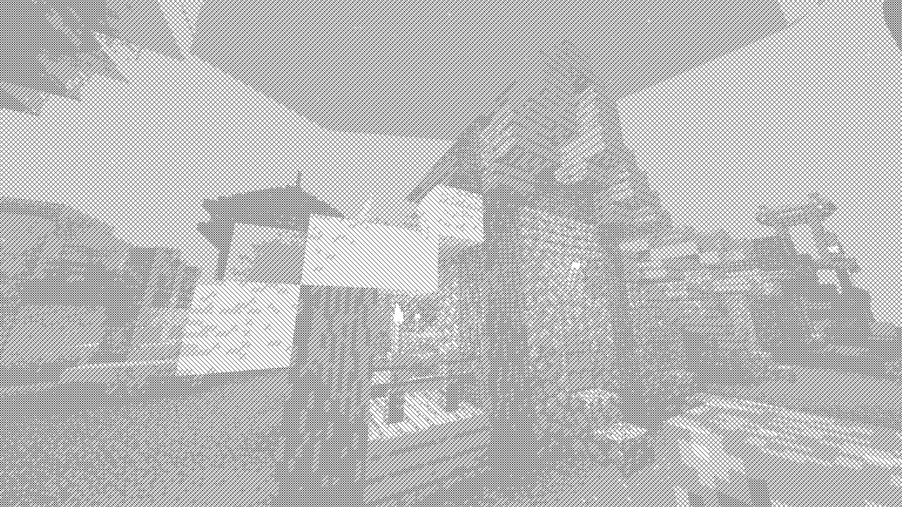
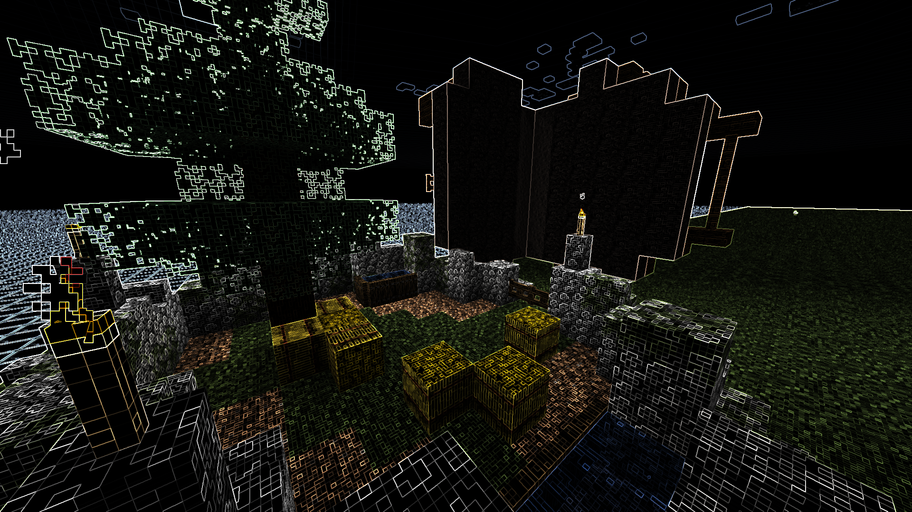

# zshaders

Vanilla Minecraft shaders—just drop them into the resourcepacks folder and go, no mods needed.

These shaders are ONLY for Minecraft Java Edition, and do not currently have any amount of backwards compatibility.

## Installation

1. GitHub unfortunately doesn't make it easy to download individual folders, so either download the entire repository as a ZIP file and extract it or `git clone` the repo.
2. Read the following documentation and ensure that you've read the additional usage notes for the packs.
3. Open Minecraft and navigate to *Options -> Resource Packs -> Open Pack Folder*, and copy the downloaded folder you wish to use into the folder.
4. Select the resource pack, then navigate back to *Options -> Video Settings* and set "Graphics" to *Fabulous!*.

## Included Resource Packs

### zshaders-ascii

An ASCII filter inspired by [Acerola's ASCII shader in ReShade FX](https://github.com/GarrettGunnell/AcerolaFX/blob/main/Shaders/AcerolaFX_ASCII.fx), but without the edge detection, which I found didn't go well with the fact that Minecraft is mostly straight lines.

> [!WARNING]
> To use this filter, you must provide the Minecraft font file (or, in future versions, any valid font). Extract the Minecraft jar file for the version you're using, and copy `assets/minecraft/textures/font/ascii.png` to this pack's `assets/minecraft/textures/effect/ascii.png`.

### zshaders-crosshatch

A black-and-white crosshatching shader inspired by [JEGX's crosshatching GLSL shader](https://www.geeks3d.com/20110219/shader-library-crosshatching-glsl-filter/). It's not particularly nice but it's intriguing, at least.

### zshaders-grainy (WIP)

A film-grain shader based on [Matt DesLaurier's GLSL shader](https://github.com/mattdesl/glsl-film-grain/) (and reimplementing the code of various packages by [Hugh Kennedy](https://github.com/hughsk)), but unfortunately much worse. Part of that is because Minecraft postprocessing shaders can't keep track of time in longer than one-second intervals, making animations loop after a second, and part of that is because I'm not totally sure what I'm doing.

### zshaders-kuwahara

A kind of scuffed [Kuwahara filter](https://en.wikipedia.org/wiki/Kuwahara_filter) that nonetheless looks pretty cool for medium-depth screenshots.

### zshaders-outline

A [Sobel/Scharr operator](https://en.wikipedia.org/wiki/Sobel_operator) outliner. The game's not super playable, but it's a really nice photo mode.

> [!NOTE]
> Most of these shaders have secret hidden settings in the source code, but you typically never need to touch them. *zshaders-outline*, however, will by default use a Sobel operator and color, and the only way to switch to the Scharr operator or grayscale is to open up the `assets/minecraft/shaders/program/entity_sobel.fsh` file and change the values of the `#DEFINE` statements.

## Note about commit history

The [Minecraft Usage Guidelines](https://www.minecraft.net/en-us/usage-guidelines) are pretty big on the idea that they don't want people distributing their code or assets. I wasn't sure how specific that was, so I went ahead and wiped out the most egregious examples in the pre-publishing commit history of Minecraft code being included. Fortunately, all the code should still work, but there is NO guarantee that any commit before the twentieth of August, 2024 will properly work.

In addition, the *zshaders-ascii* pack will not work without manual inclusion of the Minecraft font file. A free (libre) version is coming soon.
